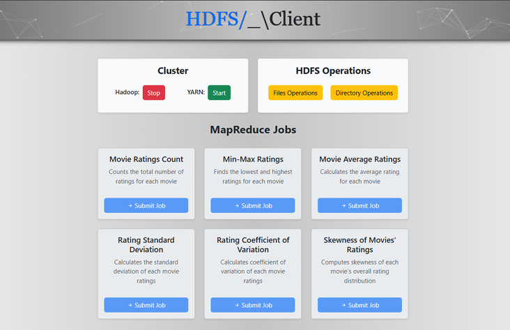
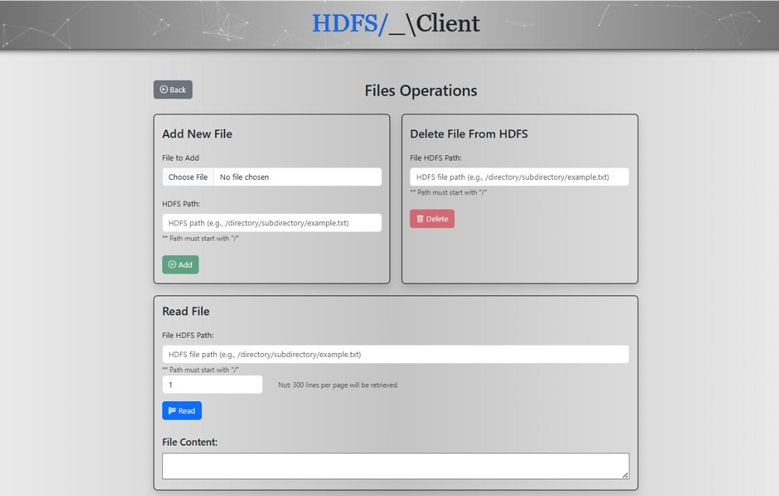
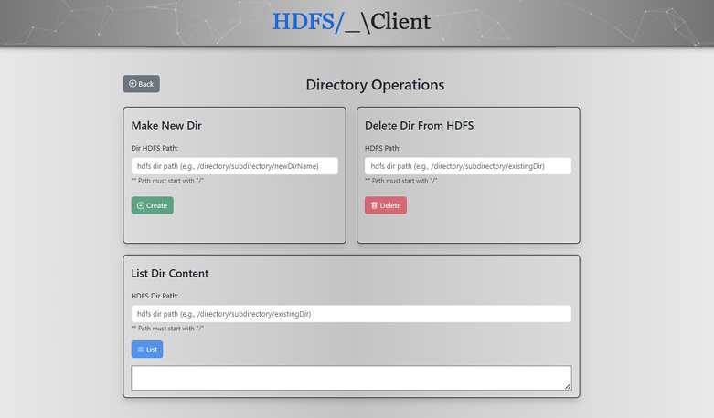
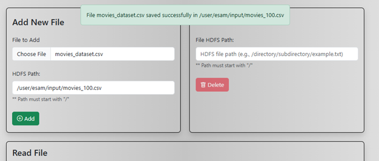
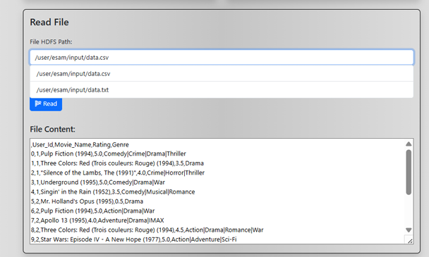
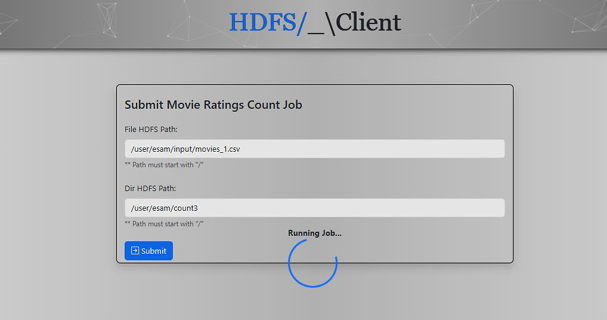
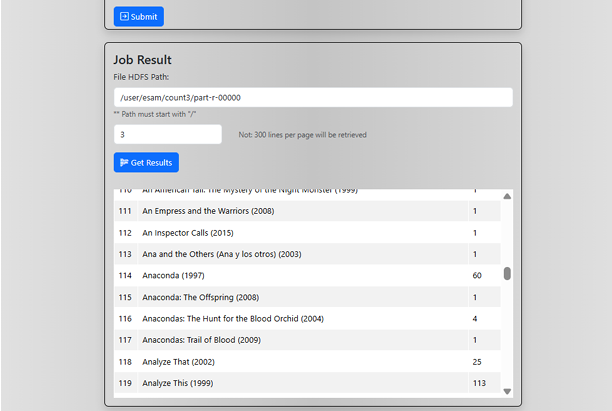

# Movie Ratings Analysis Application
This Application developed as part of a Big Data project to demonstrate real-world usage of Hadoop MapReduce for large-scale data analysis.

  

  
  

  
  

  
  

## Motivation
With the rapid growth of digital content, analyzing large-scale datasets has become essential for extracting insights and enabling data-driven decisions. This project focuses on analyzing a large-scale movie ratings dataset using the MapReduce programming model in Hadoop.

---

## Map-Reduce Jobs
This application performs statistical analysis on movie ratings data by implementing the following MapReduce jobs:

* **Movie Ratings Count** – Total number of ratings per movie
* **Average Ratings** – Mean rating value per movie
* **Min-Max Ratings** – Lowest and highest rating per movie
* **Standard Deviation** – Measures rating variability
* **Coefficient of Variation** – Relative variability of ratings
* **Skewness** – Distribution asymmetry of ratings

---

## Dataset
* Dataset Source: (http://www.kaggle.com/datasets/chaitanyahivlekar/large-movie-dataset)
* Size: ~1.5 GB
* Records: ~25 million
* Users: 7,000+
* Movies: 200,000+

## Technologies Used

### Big Data Stack
* Apache Hadoop (Pseude distributed mode)
* HDFS
* MapReduce

### Backend
* Python
* Flask (API Layer)
* 'hdfs' Python package (for WebHDFS interaction)

### Frontend
* Angular v18
* Bootstrap

### Other Tools
* Ubuntu VM
* SSH
* VS Code & IntelliJ IDEA
---

## System Architecture
The application follows a client-server architecture:

* **Frontend (Angular)** >> User Interface
* **Backend (Flask API)** >> Handles requests
* **Hadoop Cluster (VM)** >> Processes data using MapReduce
* **WebHDFS + SSH** for communication

---

## App Features

### HDFS File Management
* Create Directory
* Delete Directory
* List Directory Contents 
* Upload File (Write)
* Read File
